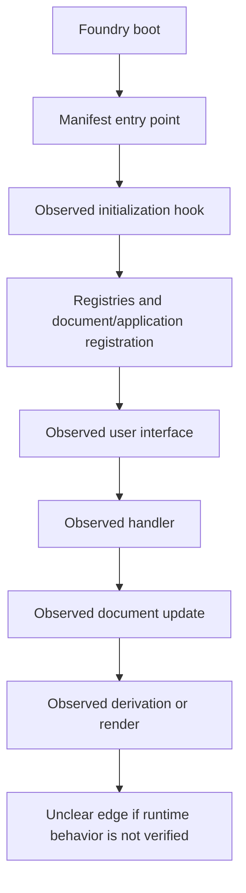

# Revision for `foundry-module-analyzer`

The attached author-generated architecture report demonstrates that the analyzer should produce more than a generic inventory. It uses a concrete architecture narrative with a project tree, domain purpose, layered folders, named entry points, subsystem-by-subsystem descriptions, and execution-flow explanations. Add the following material to `SKILL.md`.

## Add after `## Dependency and relationship analysis`

### Required analytical depth

The report must go beyond a flat file listing. Build these models when repository evidence supports them:

#### Project structure map

Start with a readable tree of important directories and files. Group files by architectural role, not only alphabetically. Include approximate file counts and identify source, generated, test, configuration, documentation, asset, compendium, localization, and vendor areas.

#### Layered architecture

Describe the module in evidence-based layers, for example:

- Manifest and bootstrapping.
- Configuration, constants, and registries.
- Data models and schema/type definitions.
- Foundry document subclasses and domain behavior.
- Derivations and pure rules calculations.
- Applications, sheets, dialogs, and UI mixins.
- Helpers, services, and integration adapters.
- Dice, rolls, chat, combat, migration, settings, and socket subsystems.
- Templates, styles, localization, packs, and build artifacts.

Do not force a layer when the repository does not support it. Mark cross-layer dependencies and boundary violations.

#### Domain model and feature inventory

Identify domain concepts and map them to Foundry entities. Where observed, describe actor/item types, embedded documents, active effects, combatants, scenes/tokens, rolls, chat messages, settings, compendium packs, and sockets. Include a feature matrix mapping major user-facing capabilities to implementing subsystems.

#### Execution and data flows

Trace concrete flows with file and line references where possible:

- Boot → manifest entry point → lifecycle hooks → registrations.
- User action → application/sheet/dialog handler → validation → document update → derived data/render.
- Roll request → roll construction → evaluation → chat output.
- Active Effect or item change → transfer/suppression/deduplication → derivations.
- Combat turn start/end → state changes → cleanup.
- Migration start → transform → embedded-document update → completion.
- Client-to-client or client-to-server socket paths.

Separate observed calls from inferred runtime ordering. Mark dynamic, missing, and unresolved edges explicitly.

#### Quantitative summary

Include reproducible counts where available: files by extension/category, entry points, hooks, classes, exported symbols, templates, stylesheets, settings, migrations, external packages, and unresolved/dynamic references. Never fabricate counts.

## Expand the report structure

Replace the current report structure with this more detailed sequence:

1. **Title and analysis metadata** — module name, repository path, revision, date, analyzer, target Foundry version, and scope.
2. **Executive summary** — main purpose, architecture style, entry points, major dependencies, and highest-priority findings.
3. **Evidence and confidence policy** — observed/inferred/unverified labels and limitations.
4. **Project structure overview** — repository tree, architectural folders, file counts, and excluded/generated areas.
5. **System/module purpose and domain model** — supported game/rule domains and mapping to Foundry entities.
6. **Architecture overview** — layered architecture, boundaries, feature matrix, and Mermaid diagrams.
7. **Entry points and initialization flow** — manifest-defined paths, hook order, registrations, and readiness assumptions.
8. **Subsystem analyses** — dedicated sections for data models, documents, derivations, sheets/applications, helpers, combat, dice/rolls, chat, migration, settings, sockets, and integrations when present.
9. **File-by-file analysis** — complete relevant-file table and detailed summaries.
10. **Dependency analysis** — file/class/hook/template/style/package tables and diagrams.
11. **Verified execution and data flows** — concrete user and lifecycle flows with evidence and uncertainty labels.
12. **Foundry v14 compliance review** — status, evidence, line references, risks, and unknowns.
13. **JavaScript/HTML/CSS/JSON review** — correctness, maintainability, accessibility, security, and data-safety observations.
14. **Build, packaging, and release review** — scripts, artifacts, paths, versions, and reproducibility.
15. **Findings prioritized by confidence and impact** — do not overstate severity.
16. **Unresolved questions and recommended next investigations**.
17. **Appendix** — commands/tools used, inventory statistics, excluded files, assumptions, glossary, and references.

## Add these detail standards

- Give each major subsystem its own purpose, key files, responsibilities, dependencies, and lifecycle role.
- Include a file-by-file table for every relevant text/configuration file, followed by deeper prose for entry points and core domain files.
- Explain why each file exists and how it participates in the architecture, not only what its filename suggests.
- Identify base classes, subclasses, mixins, registries, orchestration modules, and pure calculation modules explicitly.
- Describe exported APIs and consumers when statically traceable.
- For hooks, record hook name, registering file, callback purpose, timing category, and side effects.
- For configuration registries, record keys/categories and consumers.
- Connect templates and styles to their applications/sheets and data providers.
- For migrations, document trigger, version checks, transforms, affected documents, and persistence operations when observed.
- For combat, chat, dice, and other domain subsystems, describe end-to-end flows rather than listing filenames only.

## Suggested subsystem table template

Use a table like this for each present subsystem:

| Subsystem | Purpose | Entry files | Core classes/functions | Consumes | Produces/side effects | Confidence |
|---|---|---|---|---|---|---|
| Observed subsystem | Evidence-based summary | `path:line` | `Symbol` | Files/documents/hooks | Updates/render/chat/socket/etc. | Observed/Inferred/Unclear |

## Suggested hook table

| Hook | Registered at | Callback purpose | Timing | Side effects | Evidence |
|---|---|---|---|---|---|
| `hook-name` | `path:line` | Verified behavior | init/ready/render/update/etc. | Explicit effects | `path:line` |

## Suggested domain-flow diagram

Use only evidence-backed relationships:

## Why these changes are required

The reference report is detailed because it combines:

- A clear project tree with architectural grouping.
- The module's domain purpose and supported feature areas.
- Named entry points and initialization flow.
- Dedicated descriptions of data models, documents, derivations, sheets, applications, helpers, combat, chat, dice, migrations, settings, and assets when present.
- File responsibilities connected to dependencies and runtime flows.
- Concrete Mermaid diagrams and explicit uncertainty boundaries.

Do not copy the reference report's project-specific names or claim that every module has those folders. Generalize the method and apply only the structures discovered in the analyzed repository.
